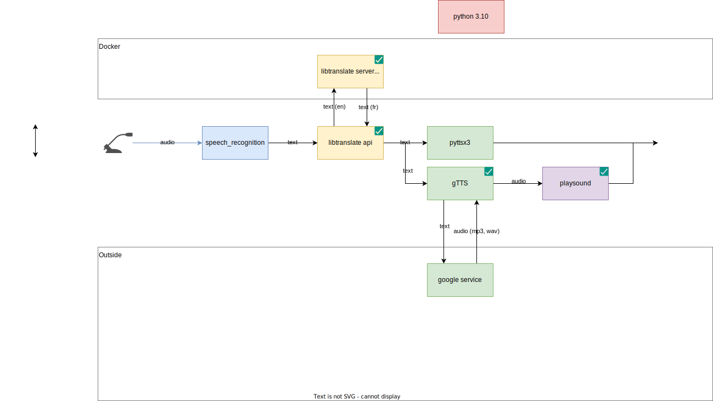

# real-time-translator

This workshop shows how to use existing technologies and API to create a real-time translator of a discussion.

# Overview



# Requirements

* docker daemon
* python 3.10.*
* virtual environment for python
* internet connection for speech to text part

# Dependencies

Python dependencies

```shell
pip install -r requirements.txt
```

In order to translate offline, we use libretranslate. To use it, you have to clone the repo and start the docker image

```
git clone https://github.com/LibreTranslate/LibreTranslate
cd LibreTranslate
./run.sh
```